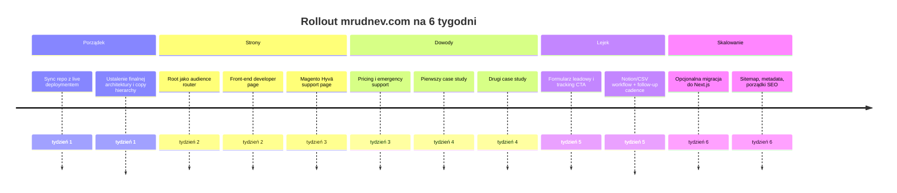

# Audyt i plan rozbudowy mrudnev.com dla rynku rekrutacyjnego Front-end oraz klientów Magento 2 i Hyvä

## Podsumowanie wykonawcze

Najważniejszy wniosek jest prosty: **nie potrzebujesz drugiej osobnej strony**, tylko **mocnego rozdzielenia intencji w ramach obecnej domeny**. Dziś mrudnev.com działa głównie jako jednostronicowe portfolio/CV, z narracją „Front-End Developer”, sekcjami typu About/Skills/Projects/Contact i CTA nastawionymi na „Resume”, GitHub oraz LinkedIn. W repozytorium widać też, że architektura jest oparta o sekcje ładowane w jednej aplikacji, a nie o osobne strony usługowe. To działa dla części rekruterów, ale słabo obsługuje klienta, który szuka konkretnego wsparcia Magento/Hyvä, zakresu usług, procesu współpracy, trybu zgłoszeń i szybkiego kontaktu. citeturn0view0 fileciteturn7file0L3-L3 fileciteturn8file0L3-L3 fileciteturn9file0L3-L3

Drugi kluczowy problem to **rozjazd między repo a live deploymentem**. Live site pokazuje starszą wersję pozycjonowania: „Front-End Developer”, „nearly five years”, stary układ doświadczeń i stopkę z rokiem 2025. Tymczasem repozytorium ma już mocniejsze pozycjonowanie: „Senior Front-End Developer”, „6+ years”, doświadczenie z Lufed IT i Hyvä, rozbudowane meta tagi, schema.org oraz bardziej biznesowy opis. Z punktu widzenia zaufania to krytyczne, bo jeśli profil na LinkedIn, rozmowa z klientem i repo mówią jedno, a live site drugie, to witryna osłabia Twoją markę zamiast ją wzmacniać. citeturn0view0 fileciteturn6file0L3-L3 fileciteturn9file0L3-L3 fileciteturn10file0L3-L3

Technicznie baza jest dobra, ale nieoptymalna do skalowania treści SEO. Repo pokazuje React 19 + Vite 6 + TypeScript + Framer Motion, z Tailwindem ładowanym z CDN i konfiguracją w `index.html`; w SEO są już canonical, OG/Twitter, JSON-LD, robots i sitemap, a także Umami do analityki. Problem w tym, że sitemap obejmuje obecnie tylko stronę główną, a Google zaleca unikalne tytuły i metaopisy dla każdej istotnej strony oraz osobne URL-e dla różnych wersji językowych. Dodatkowo Google podkreśla, że renderowanie po stronie serwera lub prerendering nadal jest bardzo użyteczne dla szybkości i dostępności treści dla robotów. Dlatego najbardziej sensowny kierunek to **zachować domenę i branding**, ale przejść na **osobne landing pages** dla obu grup odbiorców i docelowo oprzeć to o **Next.js App Router + page-level metadata**. fileciteturn13file0L3-L3 fileciteturn14file0L3-L3 fileciteturn6file0L3-L3 fileciteturn16file0L3-L3 fileciteturn18file0L3-L3 citeturn21view0turn21view2turn21view4turn17view0turn17view2

Moja rekomendacja strategiczna jest więc taka: **zostawiasz obecną stronę, ale zamieniasz ją z „jednej strony o wszystkim” na „stronę wejściową, która rozdziela ruch i intencję”**. Na root dajesz dwa wyraźne kierunki:  
**A. Front-end developer / React / Next.js dla rekruterów i hiring managerów**  
**B. Magento 2 / Hyvä support dla bezpośrednich klientów**  
Do tego dochodzą: osobne case studies, strona modeli współpracy, strona wsparcia awaryjnego, formularz kwalifikujący leady i prosty pipeline follow-up. Taki układ jest zgodny i z logiką użyteczności, i z logiką SEO: każda strona ma własny tytuł, opis, intencję, CTA i dowody. citeturn21view0turn21view2turn25view1turn25view3turn23view2

## Audyt obecnego stanu

### Co już działa na plus

Masz już kilka rzeczy, których nie trzeba wyrzucać. Repo pokazuje nowoczesną warstwę wizualną, lazy loading sekcji, karty projektów z filtrowaniem, sekcję rekomendacji, podstawy structured data oraz gotowe pliki `robots.txt`, `sitemap.xml` i `llms.txt`. To znaczy, że nie startujesz od zera; masz już fundament marki osobistej, historię doświadczenia i wizualny kierunek, który można zachować. Hyvä i Google bardzo mocno akcentują wagę performance, Core Web Vitals, uporządkowanych danych i poprawnej struktury indeksowania, więc sam fakt, że te elementy w źródle już istnieją, jest realnym plusem. fileciteturn7file0L3-L3 fileciteturn12file0L3-L3 fileciteturn21file0L3-L3 fileciteturn16file0L3-L3 fileciteturn17file0L3-L3 fileciteturn19file0L3-L3 citeturn23view0turn23view2turn15view0

Ważne jest też to, że Twoje repo już komunikuje kompetencje, których rynek realnie szuka: React, Next.js, TypeScript, Magento 2, Hyvä, performance, Core Web Vitals, SEO techniczne i doświadczenie w e-commerce. Hyvä w swojej dokumentacji i warstwie marketingowej stale buduje narrację wokół szybkości, ograniczenia JS/CSS, Core Web Vitals, CMS i supportu/migracji sklepu; to bardzo dobrze koreluje z usługami, które możesz produktowo opisać u siebie. fileciteturn9file0L3-L3 fileciteturn10file0L3-L3 fileciteturn5file0L3-L3 citeturn15view0turn15view1turn29view0

### Co dziś blokuje sprzedaż i czytelność

Największą słabością nie jest design, tylko **mieszanie dwóch zupełnie różnych intencji na jednej stronie**. Rekruter chce bardzo szybko zobaczyć seniority, stack, doświadczenie, CV, case studies, dostępność i model współpracy. Klient Magento/Hyvä chce zobaczyć: jakie problemy rozwiązujesz, czy wchodzisz w support i maintenance, czy potrafisz poprawić performance/checkout/CMS, jak wygląda zgłoszenie, czy pracujesz bezpośrednio, jaki jest model rozliczeń i czy można się do Ciebie odezwać bez „skakania po linkach”. Obecne CTA nie robią tego drugiego prawie wcale, bo hero prowadzi głównie do CV oraz sociali, a sekcja kontaktu zawiera tylko statyczne dane. citeturn0view0 fileciteturn9file0L3-L3 fileciteturn11file0L3-L3

Druga słabość to **brak tras pod konkretne zapytania i konkretne obietnice wartości**. `App.tsx` pokazuje SPA z sekcjami, `Navbar.tsx` pokazuje nawigację po sekcjach, a sitemap ma tylko jeden URL. To oznacza, że nie masz dziś osobnej strony, która mogłaby celować np. w „Magento 2 support”, „Hyvä developer”, „React Next.js contractor” albo „front-end developer Poland remote”. Google zaleca unikalne tytuły i metaopisy dla każdej ważnej strony, a osobna strona jest naturalnym miejscem na osobny `<title>`, osobny opis, osobny H1 i osobny zestaw dowodów. fileciteturn7file0L3-L3 fileciteturn8file0L3-L3 fileciteturn18file0L3-L3 citeturn21view0turn21view2turn23view2

Trzecia słabość to **niespójność live vs source**. Na żywo widoczna jest starsza narracja: tytuł „Front-End Developer”, „nearly five years of front-end experience”, doświadczenie w For Better Future jako obecne oraz brak wzmianki o Hyvä w górnej części strony. Repo mówi już coś innego: senior, 6+ lat, Lufed IT, Cloudflight, ownership Hyvä end-to-end, Core Web Vitals, AI-augmented development. Z biznesowego punktu widzenia ta rozbieżność jest ryzykowna, bo każda weryfikacja „czy ten profil jest aktualny?” kończy się dysonansem. citeturn0view0turn18view0turn18view1turn18view2 fileciteturn9file0L3-L3 fileciteturn10file0L3-L3

Czwarta słabość to **jednojęzyczność i brak strategii językowej pod dwa rynki**. W repo masz `meta name="language" content="English"` i `og:locale` ustawione na `en_US`, a widoczna treść live jest po angielsku. To jest w porządku dla części rekruterów, ale ogranicza polskie zapytania usługowe. Google zaleca osobne URL-e dla różnych wersji językowych i podkreśla, że język strony rozpoznaje przede wszystkim po widocznej treści. Innymi słowy: jeśli chcesz naprawdę łapać polski popyt na „wsparcie Magento 2 / Hyvä”, to strona usługowa powinna mieć polską treść, polski H1, polski title/meta i najlepiej docelowo polski URL lub przynajmniej polską wersję strony. fileciteturn6file0L3-L3 citeturn25view1turn25view3

Piąta słabość jest techniczna, ale ważna dla skali: repo pokazuje Vite + React, z Tailwindem ładowanym z CDN i konfiguracją osadzoną bezpośrednio w `index.html`. To jest wystarczające dla prostego portfolio, ale przy rozroście serwisu o dedykowane landingi, case studies, metadata per route, sitemap generowaną z treści i prosty CMS, **Next.js App Router** daje dużo lepszy porządek. Jest to spójne i z dokumentacją Next.js, i z zaleceniami Google dotyczącymi SSR/prerenderingu przy aplikacjach JS. fileciteturn13file0L3-L3 fileciteturn14file0L3-L3 fileciteturn6file0L3-L3 citeturn21view4turn17view0turn17view2

### Syntetyczny obraz audytu

| Warstwa | Co jest teraz | Co to oznacza biznesowo |
|---|---|---|
| Pozycjonowanie | Jedna strona portfolio, CV-first, live z narracją „Front-End Developer” i starszym bio. citeturn0view0 | Rekruter „jakoś” to czyta, klient usługowy nie dostaje jasnej oferty. |
| Architektura | Aplikacja sekcyjna SPA, bez osobnych tras usługowych; sitemap zawiera tylko root. fileciteturn7file0L3-L3 fileciteturn8file0L3-L3 fileciteturn18file0L3-L3 | Słabe dopasowanie do intencji wyszukiwania i słaba skalowalność contentu. |
| CTA | Resume, GitHub, LinkedIn; brak konsultacji, briefu, supportu awaryjnego; kontakt bez formularza. citeturn0view0 fileciteturn9file0L3-L3 fileciteturn11file0L3-L3 | Tracisz leady, które chcą napisać „mam problem ze sklepem, pomóż”. |
| SEO | Są meta tagi, canonical, OG, JSON-LD, robots, sitemap, Umami. fileciteturn6file0L3-L3 fileciteturn16file0L3-L3 fileciteturn17file0L3-L3 | Fundament dobry, ale niewystarczający bez osobnych stron i aktualizacji. |
| Język | De facto English-only. fileciteturn6file0L3-L3 citeturn0view0 | Słabsza trafność pod polskie usługi i zapytania lokalne. |
| Deployment | Live i repo są rozjechane. citeturn0view0turn18view0turn18view1turn18view2 fileciteturn9file0L3-L3 fileciteturn10file0L3-L3 | Najpierw synchronizacja, potem outreach. |

## Docelowa architektura treści

### Dlaczego warto rozbudować obecną domenę zamiast stawiać drugi serwis

To jest wniosek analityczny, nie dogmat: **lepiej rozbudować obecną domenę niż stawiać osobny serwis od zera**. Masz już działającą domenę, podstawy indeksacji, canonical, robots, sitemap, social proof, avatar, historię doświadczeń i listę projektów. Rozszczepienie tego na dwa osobne serwisy rozbiłoby uwagę, utrudniłoby utrzymanie i zmusiło Cię do duplikowania proofu. Znacznie lepiej jest wykorzystać jedną domenę, a rozdzielenie zrobić na poziomie **dedykowanych tras, unikalnych tytułów, unikalnych metaopisów i osobnych CTA**, czego i tak oczekuje Google dla ważnych stron. To podejście wspiera też App Router w Next.js: foldery odpowiadają trasom, a metadata jest definiowana per `page.tsx` lub `layout.tsx`. fileciteturn6file0L3-L3 fileciteturn16file0L3-L3 fileciteturn18file0L3-L3 citeturn21view0turn21view2turn17view0turn17view2

### Proponowana mapa tras

Poniżej układ, który najczyściej rozdziela dwa rynki, a jednocześnie nie robi od razu nadmiernie dużego projektu.

| Trasa | Główny odbiorca | Cel strony | Główne CTA | Język startowy |
|---|---|---|---|---|
| `/` | ruch mieszany | rozdzielenie intencji | „Hire me as a Front-end Developer” / „Need Magento 2 / Hyvä Support” | EN |
| `/frontend-developer` | rekruterzy, hiring managerowie, lead techy | sprzedaż Ciebie jako senior/mid+ front-end developera | „Book a screening call”, „Download CV”, „View case studies” | EN |
| `/magento-hyva-support` | bezpośredni klienci e-commerce | sprzedaż usługi support/rozwoju Magento 2 / Hyvä | „Wyślij brief”, „Potrzebuję wsparcia”, „Umów 20 min” | PL |
| `/case-studies/[slug]` | oba rynki | pokazanie dowodów i efektów | „Porozmawiajmy o podobnym projekcie” | język wg case’u |
| `/pricing` | klienci | uproszczenie decyzji zakupowej | „Zapytaj o wycenę”, „Wybierz model współpracy” | PL |
| `/emergency-support` | klienci z pilnym bólem | szybka kwalifikacja i triage | „Wyślij zgłoszenie”, „Podaj URL sklepu” | PL |
| `/contact` | oba rynki | obsługa formularzy i alternatywnych ścieżek kontaktu | „Wyślij wiadomość” | wg źródła ruchu |

### Jak ma działać strona główna

Strona główna nie powinna już próbować „wyjaśnić całego świata”. Jej zadanie ma być jedno: **w 5–7 sekund skierować użytkownika na właściwą ścieżkę**. To oznacza:

- krótki hero z jednym zdaniem o Tobie,
- dwa duże bloki wyboru odbiorcy,
- krótki trust strip z logo/typami realizacji,
- 3 najważniejsze dowody,
- krótki blok „latest availability”,
- dopiero niżej skrót doświadczenia i linki do dedykowanych podstron.

To jest lepsze i pod UX, i pod SEO, bo usuwa chaos informacyjny, a nie blokuje rozwoju kolejnych tras. Google podkreśla wagę jednoznacznych tytułów i opisów, a w kontekście języka zaleca też, by każdy URL miał czytelny język widocznej treści. Dlatego root może zostać po angielsku, ale strona usługowa Magento/Hyvä powinna być po polsku i nie mieszać języków w obrębie jednej podstrony. citeturn21view0turn21view2turn25view1turn25view3

## Zmiany priorytetowe gotowe do wklejenia

### Co zachować, co dodać, co wymienić

| Priorytet | Zachować | Dodać | Wymienić |
|---|---|---|---|
| Wysoki | domenę, branding „MR”, dark/glass visual style, listę projektów, sekcję rekomendacji | dwa landing pages, formularz leadowy, case studies, pricing/engagement, emergency support | obecny hero, obecne CTA, obecny kontakt statyczny |
| Wysoki | SEO foundation: canonical, OG, schema, robots, analytics | page-level metadata, nową sitemapę per route, dynamiczne OG dla case studies | sitemapę z jednym URL i nieaktualnym `lastmod` |
| Wysoki | doświadczenie i portfolio | dowody „problem → działanie → wynik” | opisy projektów typu „worked on homepage/category page/…” bez kontekstu biznesowego |
| Średni | CV jako asset | osobny recruiter flow | sytuację, w której CV jest głównym CTA dla każdego |
| Średni | sekcję recommendations | proof blocks dla klientów: support, performance, migration, checkout, CMS | wyłącznie ogólne „I’m always open…” w kontakcie |
| Niski | `llms.txt` i structured data | dodatkowe case schema / breadcrumb / expanded metadata | zbędne elementy meta, które nic nie wnoszą biznesowo |

### Treść strony głównej

```md
# Front-end developer for product teams and Magento stores

I help teams ship faster on React / Next.js and help e-commerce brands improve Magento 2 / Hyvä storefronts without unnecessary agency layers.

## Choose your path

### I’m hiring a Front-end Developer
For recruiters, product teams and engineering managers looking for a Front-end Developer with React, Next.js, TypeScript and e-commerce experience.

**CTA:** Go to Front-end Developer Page

### I need Magento 2 / Hyvä Support
For store owners and e-commerce teams who need direct help with Magento 2 / Hyvä: fixes, improvements, new sections, frontend support and performance work.

**CTA:** Go to Magento / Hyvä Support Page

## Why people work with me
- 6+ years in front-end and e-commerce
- React / Next.js / TypeScript + Magento 2 / Hyvä
- Direct communication, no unnecessary layers
- Strong focus on UX, performance and maintainable frontend

## Selected proof
- Magento 2 storefront work across PLP, PDP, cart, checkout and CMS
- React / Next.js production work for content and product platforms
- Experience with redesigns, fixes, migrations and ongoing support

## Availability
Currently open to:
- direct Magento / Hyvä support work
- B2B front-end roles
- short audit and implementation sprints
```

### Treść strony `/frontend-developer`

```md
# Senior Front-end Developer

React, Next.js, TypeScript, e-commerce and scalable UI work for product teams.

## What I bring
I build production-ready frontends with strong ownership, clean implementation and attention to performance, UX and maintainability.

## Core stack
- React
- Next.js
- TypeScript
- Tailwind / Styled Components / SCSS
- REST / GraphQL
- Storybook
- Magento 2 / Hyvä background

## What I’m a strong fit for
- product teams needing a reliable front-end developer
- migration work from legacy frontends
- design-to-code implementation from Figma
- performance and Core Web Vitals improvements
- component architecture and reusable UI
- e-commerce and conversion-focused pages

## Selected experience
### React / Next.js
Production work on content platforms, recruitment sites, marketplaces and e-commerce websites.

### E-commerce
Experience with Magento 2, Hyvä, checkout-related work, CMS-driven pages, account flows and conversion-sensitive UI.

## Working style
- B2B / contract friendly
- direct communication
- async-friendly
- comfortable with design, product and dev collaboration

## Case studies
[Case Study Card List Here]

## Recommendations
[2–3 strongest recommendations here]

## CTA
### Looking for a Front-end Developer?
Send me the role, team setup and expected scope. I’ll tell you quickly if there’s a good fit.

**Buttons**
- Book a screening call
- Download CV
- View case studies
```

### Treść strony `/magento-hyva-support`

```md
# Wsparcie Magento 2 / Hyvä bez pośredników

Pomagam sklepom internetowym rozwijać i naprawiać frontend Magento 2 / Hyvä: szybciej, czyściej i bez agencyjnego chaosu.

## W czym pomagam
- poprawki i bug fixing na froncie Magento 2 / Hyvä
- rozwój nowych sekcji i komponentów
- dopracowanie PDP, PLP, cart, checkout i CMS pages
- poprawa wydajności i Core Web Vitals
- porządkowanie frontendu po „szybkich fixach”
- wsparcie po wdrożeniu i stałe utrzymanie
- małe sprinty rozwojowe bez długiego procesu wejścia

## Typowe sytuacje, w których wchodzę
### Sklep działa, ale frontend zaczął boleć
Masz listę poprawek, dług techniczny albo rzeczy „do ogarnięcia”, które ciągle spadają na później.

### Potrzebujesz wdrażać rzeczy szybciej
Nowe sekcje, landing pages, CMS blocks, poprawki UX, dopracowanie mobile.

### Hyvä jest lub ma być, ale brakuje frontendowego ownership
Potrzebujesz kogoś, kto rozumie frontend sklepu end-to-end i potrafi wejść w temat bez wielkiego wdrożenia.

## Jak pracuję
- bezpośrednio z właścicielem sklepu lub e-commerce managerem
- jasno ustalony zakres
- komunikacja po ludzku
- małe sprinty albo stała współpraca
- bez „wrócimy za dwa tygodnie z estymacją”

## Modele współpracy
### Jednorazowy sprint
Dobry, jeśli masz konkretną listę zadań.

### Stałe wsparcie
Dobry, jeśli sklep wymaga regularnych poprawek i rozwoju.

### Audyt + plan działań
Dobry, jeśli nie wiesz, od czego zacząć.

## Co dostajesz
- krótką diagnozę
- propozycję zakresu
- realny plan pracy
- wdrożenie lub wsparcie wdrożenia
- porządną komunikację bez pośredników

## CTA
### Masz sklep na Magento 2 / Hyvä i potrzebujesz wsparcia?
Wyślij URL sklepu i krótki opis problemu. Odpowiem, czy mogę wejść w temat i w jakim modelu najlepiej to zrobić.

**Buttons**
- Wyślij brief
- Potrzebuję wsparcia
- Umów 20-min rozmowę
```

### Treść strony `/pricing`

```md
# Modele współpracy

## Audyt i plan działań
Jeśli nie masz pewności, co boli najbardziej, zaczynamy od krótkiego audytu i listy priorytetów.

## Sprint wdrożeniowy
Jeśli masz gotową listę zadań, wchodzę w konkretny zakres i dowożę go sprintem.

## Stałe wsparcie
Jeśli sklep potrzebuje regularnych poprawek, rozwoju i szybkiego reagowania.

## Kiedy który model ma sens
### Audyt
Gdy jest chaos, backlog i nie wiadomo, od czego zacząć.

### Sprint
Gdy potrzebujesz zamknąć konkretny zakres w krótkim czasie.

### Stała współpraca
Gdy frontend sklepu żyje i regularnie potrzebuje rozwoju.

## Jak wyceniam
Każdy zakres wyceniam po krótkim opisie problemu lub po rozmowie. Jeśli chcesz, mogę też pracować w modelu miesięcznym.

## CTA
- Wyślij zakres
- Zapytaj o wycenę
- Umów rozmowę
```

### Treść strony `/emergency-support`

```md
# Pilne wsparcie Magento 2 / Hyvä

Jeśli masz pilny problem na froncie sklepu, opisz go krótko i wyślij zgłoszenie. Najszybciej pomagam tam, gdzie problem jest jasno opisany i można szybko wejść w kontekst.

## Najczęstsze przypadki
- frontend po wdrożeniu się rozjechał
- koszyk / checkout działa źle
- mobile ma krytyczne błędy
- CMS lub nowe sekcje psują layout
- po zmianach spadła wydajność albo użyteczność

## Co wysłać w pierwszej wiadomości
- URL sklepu
- co dokładnie nie działa
- od kiedy problem występuje
- czy błąd jest na produkcji
- screeny / nagranie
- kontakt do osoby decyzyjnej

## Jak wygląda pierwszy krok
Po zgłoszeniu dam znać:
- czy mogę wejść w temat
- czy to tryb „quick fix”, sprint czy dłuższe wsparcie
- czego jeszcze potrzebuję, żeby ruszyć

## CTA
- Wyślij pilne zgłoszenie
```

### Szablon case study

```md
# [Nazwa projektu]

## Szybki opis
- Klient / branża:
- Typ projektu:
- Zakres mojej pracy:
- Stack:
- Model współpracy:
- Rok:

## Punkt wyjścia
Opisz problem biznesowy i techniczny w 3–5 zdaniach.

## Co było do zrobienia
Opisz zakres: frontend, checkout, CMS, performance, redesign, fixy, migracja.

## Co zrobiłem
Podziel na 3–6 konkretnych bloków:
- analiza
- implementacja
- poprawa UX
- performance
- współpraca z backendem / SEO / designem

## Efekt
Opisz wynik w języku biznesowym i technicznym.

## Co warto zobaczyć
- BEFORE screenshot
- AFTER screenshot
- mobile
- desktop
- performance metrics
- komentarz, co się zmieniło

## Najważniejsze liczby
- LCP:
- CLS:
- INP:
- konwersja / engagement:
- liczba wdrożonych elementów:
- czas realizacji:

## Moja rola
Jednoznacznie napisz, za co odpowiadałeś samodzielnie.

## CTA
Jeśli masz podobny problem w Magento 2 / Hyvä albo szukasz Front-end Developera do podobnego zakresu, napisz do mnie.
```

### Mikrocopy do CTA

| Miejsce | CTA główne | CTA pomocnicze |
|---|---|---|
| Root | Go to Front-end Developer Page | Need Magento 2 / Hyvä Support |
| Front-end page | Book a screening call | Download CV |
| Front-end page | View case studies | Check availability |
| Magento page | Wyślij brief | Umów 20-min rozmowę |
| Magento page | Potrzebuję wsparcia | Zobacz case studies |
| Pricing | Zapytaj o wycenę | Wyślij zakres |
| Emergency | Wyślij pilne zgłoszenie | Opisz problem |

### Pola formularza kontaktowego

#### Formularz ogólny

```txt
Imię i nazwisko
E-mail
Firma
Rola
Strona internetowa / URL projektu
Typ zapytania
Treść wiadomości
Zgoda na kontakt
```

#### Formularz dla rekrutera

```txt
Company name
Your role
Work model
Role title
Stack / team context
Contract type
Budget / rate range
Expected start date
JD URL
Message
Email
```

#### Formularz dla klienta Magento / Hyvä

```txt
Imię
E-mail
Firma
URL sklepu
Czy to Magento 2 / Adobe Commerce / Hyvä / nie wiem
Typ potrzeby: support / rozwój / audyt / pilne zgłoszenie
Największy problem
Zakres lub lista zadań
Preferowany model: sprint / stałe wsparcie / audyt
Orientacyjny termin
```

### Krótkie szablony pierwszego kontaktu do klientów

```md
Temat: Krótka pomoc przy Magento 2 / Hyvä

Cześć [Imię],

trafiłem na [nazwa sklepu] i widzę, że działacie na Magento 2 / Hyvä.
Pomagam bezpośrednio sklepom w obszarze frontendu: poprawki, nowe sekcje, wydajność, UX i bieżący support.

Jeśli macie teraz backlog rzeczy „do ogarnięcia” albo potrzebujecie kogoś do szybszego dowożenia zmian, mogę wejść w temat w modelu sprintowym albo stałego wsparcia.

Jeśli chcesz, podeślę krótko:
- jak zwykle wchodzę w taki zakres,
- co mogę przejąć,
- i czy widzę szybkie usprawnienia po krótkim review.

Pozdrawiam
Mykola Rudnev
mrudnev.com
```

```md
Temat: Magento 2 / Hyvä – szybki review frontendu?

Cześć [Imię],

pomagam sklepom na Magento 2 / Hyvä przy front-endzie i rozwoju po wdrożeniu.
Jeśli chcesz, mogę zrobić krótki review Waszego frontu i wskazać:
- co warto poprawić najszybciej,
- co spowalnia wdrażanie zmian,
- gdzie są potencjalne quick wins pod UX / wydajność.

Bez długiego procesu i bez agencyjnych warstw.
Jeśli temat jest aktualny, daj znać.

Pozdrawiam
Mykola
```

## Lejek leadów i outreach

### Jak powinien działać prosty workflow

Najprostszy sensowny lejek nie musi mieć żadnego „enterprise CRM”. Wystarczy Notion, Airtable albo nawet CSV, jeśli pola są dobrze przemyślane. Najważniejsze jest to, żebyś rozdzielił **źródło leada**, **problem**, **dopasowanie**, **następny krok** i **datę follow-upu**. W praktyce większość ludzi gubi leady nie dlatego, że nie mają systemu, tylko dlatego, że nie mają rytmu i pola „next action”. To wdrożysz w jeden wieczór.  

```mermaid
flowchart TD
    A[Lead source] --> B[Qualification]
    B --> C{Audience}
    C -->|Recruiter| D[/frontend-developer]
    C -->|Direct client| E[/magento-hyva-support]
    D --> F[Contact form or call]
    E --> F
    F --> G[Discovery notes]
    G --> H{Fit?}
    H -->|Yes| I[Proposal / next step]
    H -->|Maybe later| J[Follow-up queue]
    H -->|No| K[Archive with reason]
    I --> L[Closed won]
    L --> M[Request testimonial / build case study]
```

### Schemat kolumn do Notion lub CSV

| Kolumna | Po co to jest |
|---|---|
| `lead_id` | unikalny identyfikator |
| `date_added` | data dodania |
| `source` | LinkedIn / email / referral / website / outbound |
| `audience` | recruiter / direct_client |
| `company` | nazwa firmy |
| `contact_name` | osoba kontaktowa |
| `contact_role` | rola decyzyjna |
| `website_url` | URL firmy / sklepu |
| `platform` | Magento 2 / Adobe Commerce / Hyvä / React / unknown |
| `country` | lokalizacja |
| `language` | PL / EN |
| `pain_point` | główny problem lub potrzeba |
| `service_fit` | support / sprint / audit / hiring |
| `opportunity_score` | 1–5 |
| `last_contact_at` | ostatni kontakt |
| `next_action` | co robisz dalej |
| `next_followup_at` | data follow-upu |
| `status` | new / contacted / replied / call booked / proposal / won / lost |
| `notes` | notatki |
| `case_study_used` | jaki case wysłałeś |
| `outcome_reason` | dlaczego wygrałeś / przegrałeś |

### Rytm follow-upów

| Dzień | Kanał | Cel |
|---|---|---|
| dzień zero | email / formularz / LinkedIn | pierwszy kontakt |
| dzień trzeci | krótki follow-up | przypomnienie z value-add |
| dzień siódmy | drugi follow-up | konkret: audyt, call, krótka diagnoza |
| dzień czternasty | ostatni follow-up klasyczny | zamknięcie pętli |
| dzień trzydziesty | re-activation | nowy case, nowa dostępność, nowa potrzeba |

### Szablony follow-upów

```md
Temat: Re: Magento 2 / Hyvä

Cześć [Imię],

wracam krótko do wiadomości.
Jeśli temat Magento 2 / Hyvä jest nadal aktualny, mogę zacząć od prostego kroku:
krótkiego review albo wejścia w mały sprint na konkretny zakres.

Jeśli nie teraz, też okej — daj tylko znać, czy wrócić do tematu później.

Pozdrawiam
Mykola
```

```md
Temat: Re: Front-end role

Hi [Name],

just checking back in.
If the role is still open, I’m happy to review the setup quickly and tell you whether I’m a strong fit.

If helpful, I can also send:
- a short summary of relevant React / Next.js work,
- availability,
- and 2–3 most relevant case studies.

Best,
Mykola
```

```md
Temat: Czy wrócić do tematu?

Cześć [Imię],

zamykam sobie teraz kilka otwartych rozmów, więc dopytam wprost:
czy temat wsparcia Magento / Hyvä jest u Was jeszcze aktualny?

Jeśli tak, mogę podpowiedzieć najlepszy model startu:
- szybki audyt,
- mały sprint,
- albo stałe wsparcie.

Pozdrawiam
Mykola
```

## SEO, słowa kluczowe i dowody

### Co zmienić w SEO na poziomie strategii

Twoje obecne źródło ma już podstawy SEO, ale dalej nie daje wystarczającej powierzchni pod dwa segmenty rynku. Google zaleca, by każda ważna strona miała **unikalny, opisowy tytuł** i **unikalny metaopis**, a structured data powinny opisywać to, co faktycznie widać na stronie. Google podkreśla również, że prerendering lub SSR nadal przyspieszają stronę dla użytkowników i botów, a w przypadku wielu języków zaleca osobne URL-e i jasne oznaczenie stron językowych. Z kolei dokumentacja Hyvä podkreśla performance, Core Web Vitals, Lighthouse/RUM, CMS oraz praktyczny support. Wspólny wniosek: **dla Ciebie SEO = architektura informacji + dowody + osobne strony**, a nie dokładanie kolejnych keywordów do jednej strony. citeturn21view0turn21view2turn23view0turn21view4turn25view1turn25view3turn15view0turn15view1

### Proponowane klastry słów kluczowych

| Strona | Polski | English |
|---|---|---|
| `/frontend-developer` | front-end developer react next.js, react developer b2b, senior frontend developer poland, developer typescript zdalnie | senior frontend developer react next.js, react contractor europe, next.js developer remote, typescript frontend developer |
| `/magento-hyva-support` | wsparcie magento 2, support magento 2, developer hyva, hyva support, frontend magento 2, utrzymanie sklepu magento, poprawki magento 2, optymalizacja hyva | magento 2 support, hyva developer, hyva support, magento frontend developer, magento storefront optimization |
| `/pricing` | wycena magento 2 support, audyt magento 2, wsparcie frontend sklepu | magento support pricing, frontend audit ecommerce, fractional frontend support |
| `/emergency-support` | pilne wsparcie magento 2, szybka pomoc magento, awaria frontend sklepu magento | urgent magento support, emergency hyva support, ecommerce frontend fix |
| case studies | case study magento 2, wdrożenie hyva, poprawa core web vitals sklep | magento case study, hyva migration case study, next.js ecommerce case study |

### Proponowane meta tagi dla kluczowych stron

Poniższe propozycje są zwięzłe celowo. Google nie daje magicznego limitu znaków, ale tytuły i opisy są przycinane do szerokości urządzenia, więc liczy się przede wszystkim czytelność i odrębność strony. citeturn21view0turn21view2

| Strona | Title | Meta description |
|---|---|---|
| `/` | `Mykola Rudnev | Front-end Developer and Magento 2 / Hyvä Support` | `Front-end Developer for React / Next.js teams and direct Magento 2 / Hyvä support for e-commerce stores. Case studies, availability and direct contact.` |
| `/frontend-developer` | `Senior Front-end Developer React / Next.js / TypeScript | Mykola Rudnev` | `Senior Front-end Developer with React, Next.js, TypeScript and e-commerce experience. Available for B2B roles, product teams and fast-moving frontend work.` |
| `/magento-hyva-support` | `Wsparcie Magento 2 / Hyvä bez pośredników | Mykola Rudnev` | `Pomagam sklepom na Magento 2 / Hyvä przy frontendzie, poprawkach, nowych sekcjach, wydajności i stałym wsparciu. Bez pośredników, bez agencyjnych warstw.` |
| `/pricing` | `Modele współpracy Magento 2 / Hyvä i Front-end | Mykola Rudnev` | `Audyt, sprint wdrożeniowy lub stałe wsparcie. Zobacz, w jakim modelu najlepiej rozpocząć współpracę przy Magento 2 / Hyvä lub frontendzie.` |
| `/emergency-support` | `Pilne wsparcie Magento 2 / Hyvä | Mykola Rudnev` | `Masz pilny problem na froncie sklepu Magento 2 / Hyvä? Wyślij URL i opis błędu. Szybko ocenię, czy mogę wejść w temat.` |

### Structured data, które warto utrzymać i rozszerzyć

W `index.html` masz już `Person`, `WebSite`, `ProfessionalService` i `ItemList`, co jest dobrym kierunkiem. Google podkreśla, że uporządkowane dane mają wyraźnie opisywać widoczną treść strony i mogą zwiększyć atrakcyjność wyniku wyszukiwania. W praktyce oznacza to, że przy rozbudowie serwisu warto:  

- utrzymać `Person` na stronach osobistych,
- utrzymać lub rozdzielić `ProfessionalService` na stronie usługowej,
- dodać `BreadcrumbList` dla tras typu case study,
- trzymać `ItemList` dla list case studies lub projektów,
- generować JSON-LD per page, a nie tylko na root. fileciteturn6file0L3-L3 citeturn23view0turn17view2

### Jakie dowody pokazywać w case studies

Hyvä w dokumentacji performance wskazuje wprost: liczy się mierzenie wydajności, Core Web Vitals, Lighthouse oraz dane rzeczywiste. To podpowiada, jakie dowody powinieneś pokazywać w case studies. Zamiast samych logotypów i listy technologii pokazuj **przed/po** oraz **metryki**, najlepiej takie, które klient lub rekruter zrozumie w 10 sekund. citeturn15view0

| Element | BEFORE | AFTER | Jaki komentarz dodać |
|---|---|---|---|
| PDP / PLP | screen obecnego stanu | screen po wdrożeniu | co poprawiłeś w UX i czemu |
| Mobile menu / header | chaos / długi scroll / bug | uproszczona wersja | wpływ na mobile UX |
| Checkout / cart | problematyczny krok | uproszczony flow | mniej tarcia / szybszy completion |
| CMS section | stary blok / sztywny layout | nowy komponent | łatwiejsze utrzymanie dla content teamu |
| Lighthouse / CWV | screenshot wyników przed | screenshot po | data pomiaru, środowisko |
| Search Console / GA | trend wejść / CTR / bounce | trend po zmianie | tylko jeśli masz zgodę i dane |

### Jakie metryki warto pokazywać

| Kategoria | Metryki |
|---|---|
| Wydajność | LCP, CLS, INP, TTFB, Lighthouse mobile |
| UX / biznes | współczynnik konwersji, CTR do kluczowego CTA, pages/session, bounce rate |
| Delivery | czas wdrożenia, liczba ticketów zamkniętych, liczba komponentów, skrócenie czasu publikacji zmian |
| SEO | organic traffic, CTR, impressions, visibility na wybrane strony |
| Support | czas reakcji, liczba poprawek miesięcznie, czas od zgłoszenia do wdrożenia |

Dobrą zasadą jest publikowanie tylko tych liczb, które umiesz obronić. Jeśli nie możesz pokazać KPI klienta, pokaż **metryki wykonawcze**, np. „wdrożyłem 12 nowych sekcji CMS + refactor kluczowych komponentów PLP/PDP + poprawa mobilnego Lighthouse z X do Y”. To nadal buduje wiarygodność.

## Implementacja techniczna i harmonogram

### Minimalny kierunek techniczny

Najbardziej pragmatyczny wariant to taki:

- zachowujesz aktualny styl wizualny i logikę komponentów,
- migrujesz strukturę serwisu do **Next.js App Router**,
- przestajesz ładować Tailwind z CDN i przenosisz go do lokalnej konfiguracji,
- budujesz trasy jako `app/frontend-developer/page.tsx`, `app/magento-hyva-support/page.tsx`, `app/pricing/page.tsx`, `app/emergency-support/page.tsx`, `app/case-studies/[slug]/page.tsx`,
- używasz `metadata` / `generateMetadata` dla title/description/OG,
- generujesz `robots.txt` i `sitemap.xml` z rzeczywistej listy tras,
- case studies trzymasz na start jako **MDX z frontmatterem w repo**, bo to najszybszy „CMS” dla developera,
- formularz kontaktowy podpinasz do route handlera + Resend lub podobnego mailera + honeypot / CAPTCHA,
- zostawiasz Umami albo dodajesz warstwę eventów pod CTA i formularze. citeturn17view0turn17view2turn21view4 fileciteturn6file0L3-L3

To jest lepsze od rozbudowy obecnego Vite SPA nie dlatego, że Vite jest zły, tylko dlatego, że Twoje potrzeby przesuwają się z „wizytówki” do „małego serwisu sprzedażowego z proofem i SEO”. Next.js zwyczajnie lepiej porządkuje routing, metadata i content routes. Jednocześnie nie musisz robić „big bang rewrite”. Najpierw możesz odtworzyć obecny wygląd i komponenty, potem dopinać nowe strony. citeturn17view0turn17view2turn21view4

### Szacowany wysiłek

Przyjmuję orientacyjnie:
- **Low**: do jednego dnia pracy,
- **Medium**: jeden do trzech dni,
- **High**: trzy do sześciu dni lub więcej.

| Zadanie | Effort | Uwagi |
|---|---|---|
| Synchronizacja live z aktualnym source | Low | absolutny pierwszy krok |
| Przepisanie hero i CTA na root | Low | duży efekt przy małym koszcie |
| Dodanie `/frontend-developer` | Medium | nowy content + metadata |
| Dodanie `/magento-hyva-support` | Medium | nowy content + formularz CTA |
| Dodanie `/pricing` | Low | głównie treść i layout |
| Dodanie `/emergency-support` | Low | prosta strona wysokiej intencji |
| System case studies na MDX | Medium | dynamic route + lista wpisów |
| 2 pierwsze case studies | Medium | największa robota to treść i screeny |
| Formularz kontaktowy z kwalifikacją leadów | Medium | backend mail + walidacja + anti-spam |
| Event tracking CTA i formularzy | Low | Umami / custom events |
| Migracja Vite → Next.js App Router | High | ale bardzo opłacalna strategicznie |
| Przeniesienie Tailwind z CDN do repo | Medium | porządek techniczny |
| Dynamiczne sitemap/robots/OG | Medium | po migracji do Next najłatwiejsze |
| Wersje językowe / hreflang | Medium | wdrażaj dopiero po ustaleniu core pages |

### Checklist wdrożeniowy

- [ ] Zsynchronizować live deployment z aktualnym repo i usunąć rozjazd komunikacyjny.
- [ ] Zmienić root z portfolio-all-in-one w audience router.
- [ ] Dodać dwie kluczowe strony: `/frontend-developer` i `/magento-hyva-support`.
- [ ] Zmienić kontakt statyczny na formularze kwalifikujące leady.
- [ ] Opublikować przynajmniej dwa case studies z sekcją BEFORE/AFTER.
- [ ] Dodać `/pricing` i `/emergency-support`.
- [ ] Ustawić mierzenie kliknięć w CTA, wysłań formularzy i źródeł leadów.
- [ ] Rozważyć migrację do Next.js po ustabilizowaniu contentu.
- [ ] Rozszerzyć sitemapę o wszystkie kluczowe trasy.
- [ ] Dopiero potem robić intensywniejszy outbound.

### Proponowany rollout



### Ostateczna rekomendacja

Gdybym miał sprowadzić cały raport do jednej decyzji, brzmiałaby ona tak:

**Rozszerzaj obecną stronę, ale przestań traktować ją jak portfolio „dla wszystkich”.**  
Zamień ją w **maszynę do rozdzielania dwóch intencji**:

- dla rekruterów: szybki, czytelny, mocny profil Front-end Developera,
- dla klientów bezpośrednich: konkretna, zrozumiała usługa Magento 2 / Hyvä z niskim progiem kontaktu.

Masz już solidny fundament techniczny i wizualny. Teraz potrzebujesz nie „ładniejszej strony”, tylko **ostrzejszej oferty, lepszej architektury treści i prostszego wejścia w kontakt**. Jeśli zrobisz tylko trzy rzeczy w pierwszej kolejności, niech to będą:  
**synchronizacja live z repo, nowy root jako audience router i strona `/magento-hyva-support` z formularzem kwalifikującym leady.** citeturn0view0turn21view0turn21view2turn21view4turn25view3turn15view0turn29view0